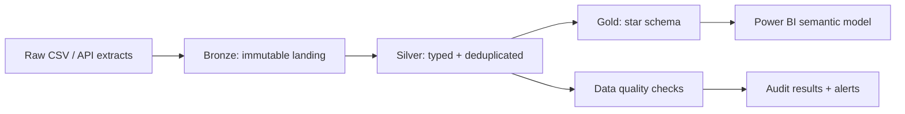

# Financial Services Analytics Platform

Production-style analytics engineering case study using **synthetic data**. It demonstrates how I would turn policy and transaction events into trusted reporting tables for finance and operations teams.

> This repository contains no client, employer, or confidential data. All records are fictional and intentionally small so the pipeline can be reviewed quickly.

## Why this project matters

A reporting team needs daily visibility into active accounts, transaction volume, exceptions, and customer value. Raw operational extracts are inconsistent: dates arrive in multiple formats, duplicate events appear during retries, and business metrics need a common definition.

This project addresses that problem with a layered design that is portable to Microsoft Fabric, Snowflake, Databricks, or SQL Server.



## What is included

- A Python ingestion and transformation pipeline with incremental-friendly logic.
- Bronze, silver, and gold layer contracts.
- A dimensional model with customer, account, date, and transaction dimensions.
- SQL validation checks for uniqueness, referential integrity, nulls, and business rules.
- Pytest coverage for transformation behavior.
- GitHub Actions quality gate for linting and tests.
- Small synthetic source extracts that make the project reproducible without credentials.

## Repository map

```text
data/raw/                  Synthetic source extracts
sql/                       Warehouse DDL and quality checks
src/pipeline.py            Typed, deduplicated transformation pipeline
tests/test_pipeline.py     Business-rule tests
docs/architecture.md       Design decisions and production mapping
```

## Run locally

```bash
python -m venv .venv
# Windows: .venv\Scripts\activate
# macOS/Linux: source .venv/bin/activate
pip install -e ".[dev]"
python -m src.pipeline
pytest
```

The pipeline writes curated files to `data/processed/` (ignored from Git) and prints a compact quality summary.

## Engineering decisions

1. **Idempotency:** transaction events are deduplicated using the business event key, so rerunning a batch does not inflate metrics.
2. **Layer separation:** raw inputs remain auditable while business logic is isolated in silver and gold transformations.
3. **Metric ownership:** revenue, fee, and exception logic is defined once in the gold layer instead of being recreated in every dashboard.
4. **Observability:** row counts and failed checks are emitted as pipeline output so an orchestration layer can publish them to monitoring.
5. **Privacy by design:** only synthetic data is committed; production deployments would use managed identities, secret stores, and restricted workspaces.

## Portfolio talking points

- Designed an analytics-ready star schema instead of connecting dashboards directly to operational extracts.
- Built reusable quality checks for duplicate events, invalid status values, negative amounts, and orphan keys.
- Demonstrated a migration-friendly medallion pattern suitable for Microsoft Fabric Lakehouse/Warehouse.
- Separated technical pipeline outputs from business-facing measures, improving trust and maintainability.

## Next production steps

- Replace CSV landing with Fabric Data Factory/API connectors.
- Add watermark-based incremental loading and pipeline metadata tables.
- Publish the gold tables to a governed semantic model.
- Add deployment environments, data contracts, and alert routing to the support channel.

